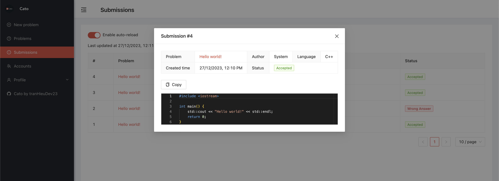

<h1 align="center">Cato</h1>
<p align="center">
    
</p>
<p align="center">
    Online Judge system you can host locally!
</p>

<a name="table-of-contents"></a>

## Table of contents

-   [Table of contents](#table-of-contents)
-   [Description](#description)
-   [Installation](#installation)
    -   [Requirements](#requirements)
    -   [Clone the project](#clone-the-project)
    -   [Build from source](#build-from-source)
    -   [Generate code](#generate-code)
    -   [Linting](#linting)
-   [Usage](#usage)
    -   [Running in local mode](#running-in-local-mode)
    -   [Running in distributed mode](#running-in-distributed-mode)
    -   [Editing problem statements](#editing-problem-statements)
    -   [Custom client](#custom-client)
-   [Config](#config)
    -   [CLI Arguments](#cli-arguments)
    -   [Config files](#config-files)
-   [TODO](#todo)
-   [License](#license)

<a name="description"></a>

## Description

Cato is a simple web-based Online Judge system for competitive programming problems. Designed with local setup in mind, it can be set up with minimal effort, depending only on Docker for containerization of test runs. At the same time, it can also run in a simple distributed host-worker mode, distributing submissions to multiple judge worker machines for more efficient operation.



<a name="installation"></a>

## Installation

<a name="requirements"></a>

### Requirements

Docker or a Docker-compatible container runtime must be installed locally to run Cato process in local/distributed worker mode.

To develop the project, [OpenAPI Generator](https://github.com/OpenAPITools/openapi-generator) is required as it is used to generate the Front End's HTTP API client.

### Clone the project

```bash
git clone https://github.com/tranHieuDev23/Cato.git
```

### Build from source

```bash
# To build for all popular desktop platform
make build-all

# To build for your local platform
make build
```

### Generate code

Cato uses code generation for three purposes:

1. Compile-time dependency injection with [github.com/google/wire](https://github.com/google/wire).
2. Generation of JSON-RPC [server](/internal/handlers/http/rpc/rpcserver/) and [client boilerplate](/internal/handlers/http/rpc/rpcclient/), plus [OpenAPI specification](/api/swagger.json) using [gitlab.com/pjrpc/pjrpc](https://gitlab.com/pjrpc/pjrpc).
3. Generation of TypeScript's HTTP Client using [OpenAPI Generator](https://github.com/OpenAPITools/openapi-generator).

To execute all code generation procedure:

```bash
make generate
```

### Linting

```bash
make lint
```

<a name="usage"></a>

## Usage

### Running in local mode

Just double click on the executable!

The default options is to start the Online Judge server as a standalone process on the local machine, serving both host and worker logic. This is convenient for simple local use cases, with the drawback being that you only have the computational resource of a single machine to evaluate incoming submissions.

### Running in distributed mode

To distribute submissions to be evaluated on multiple machines, you can run the system in distributed mode. In this mode, the single HTTP host server is considered to be the source of trust, while one or more worker processes synchronize information with the host over time and periodically fetching the oldest available submission to judge.

Starting the HTTP host server by executing the following command:

```bash
cato --distributed
```

Starting the worker process by executing the following command:

```bash
cato --distributed \
    --worker \
    --host-address <address of the host with the prefix http:// or https://> \
    --worker-account worker \
    --worker-password changeme
```

Make sure that all worker machine have its own Docker (or a Docker-compatible container runtime) running locally and can access the host's HTTP server.

### Editing problem statements

[QuillJS](https://quilljs.com/) is the editor for text problem description, while [Katex](https://katex.org/) is used for math typesetting, allowing problem setters to write rich problem statements with proper math annotations.


### Custom client

Thinking that the web client sucks? You can totally write (or better yet, generate) your own HTTP client for Cato using [the generated OpenAPI 3.0 specification](/api/swagger.json).

In fact, this project was created because I discovered that [the code generation pipeline using pjrpc and OpenAPI Generator](#generate-code) is so powerful that it allows me to finish this project within just 5 days!

<a name="config"></a>

## Config

### CLI Arguments

| Argument                    | Description                                                                                                                                                                                                  | Default Value           |
| --------------------------- | ------------------------------------------------------------------------------------------------------------------------------------------------------------------------------------------------------------ | ----------------------- |
| `--distributed`             | If provided, will start the program in distributed mode.                                                                                                                                                     | `false`                 |
| `--worker`                  | If provided and `--distributed` is set, will start the program as a worker process in distributed mode.                                                                                                      | `false`                 |
| `--no-browser`              | If provided, will not open a browser window when the server starts.                                                                                                                                          | `false`                 |
| `--host-address`            | The address of the host server when running in worker mode.                                                                                                                                                  | `http://127.0.0.1:8080` |
| `--worker-account-name`     | The worker account name when running in worker mode.                                                                                                                                                         | `worker`                |
| `--worker-account-password` | The worker account password when running in worker mode.                                                                                                                                                     | `changeme`              |
| `--config-file-path`        | If provided, will use the provided config file.                                                                                                                                                              |                         |
| `--pull-image-at-startup`   | Whether to pull Docker images necessary for compiling and executing test case at startup. If set to true and Docker fails to pull any of the provided image, the program will exit with non-zero error code. | `true`                  |

### Config files

Cato use a YAML config file to configure its inner working in more details. By default, if no custom config file is provided, values in the config file [configs/local.yaml](configs/local.yaml) are used.

<a name="Todo"></a>

## TODO

-   [x] Problem example list - Small set of small test cases that users can view and copy
-   [ ] Custom output evaluation method:
    -   [ ] Evaluation using custom scripts running inside containers
-   [ ] Contests
    -   [ ] ACM Scoring Mode - Problems are either completely `Accepted` or not
    -   [ ] IOI Scoring Mode - Problems are scored based for passed test cases
    -   [ ] Ranking dashboard
-   [x] Feature flags
    -   [x] Enable/disable account registration
    -   [x] Enable/disable problem/test case creation
    -   [x] Enable/disable submissions
-   [ ] Account disabling
-   [ ] Support for more database engines
-   [ ] Dark mode
-   [ ] Better documentation

<a name="licence"></a>

## License

[MIT](https://choosealicense.com/licenses/mit/)
